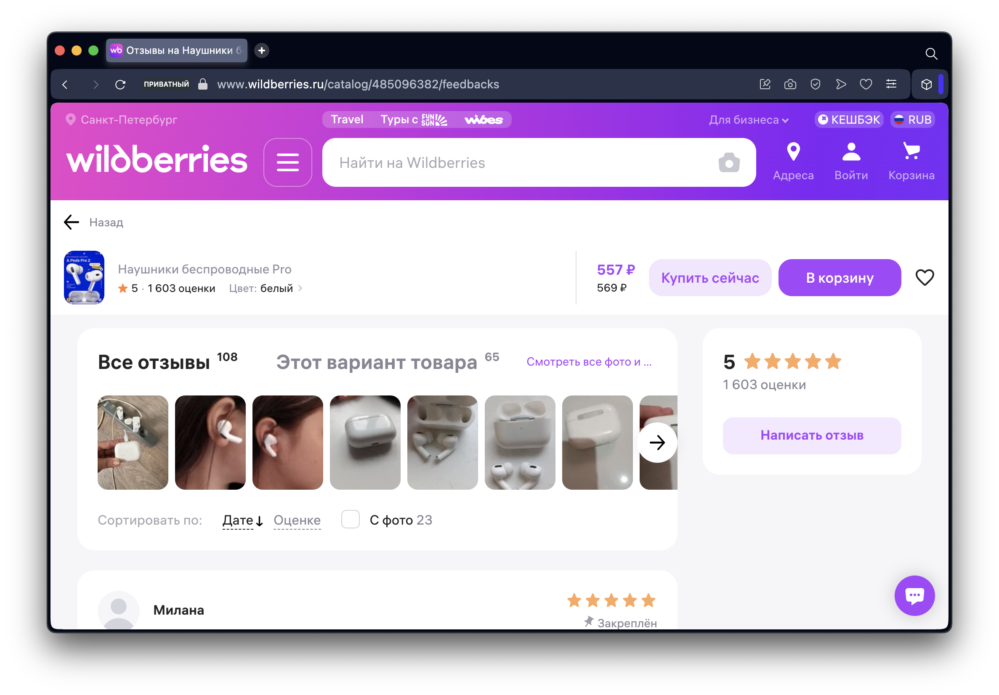
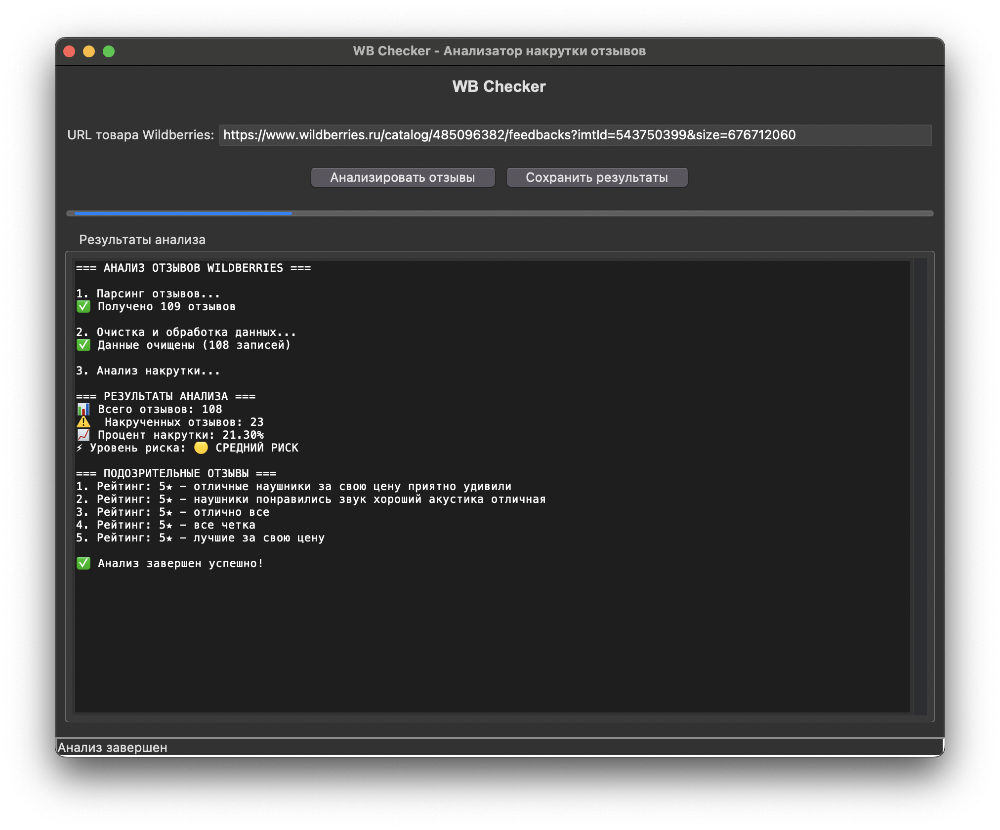

<div align="center">
  <h1> WB Checker: Анализатор накрутки отзывов Wildberries</h1>
  <h3>Обнаружение подозрительных отзывов с помощью машинного обучения / Wildberries fake reviews detection with ML</h3>

  [](https://python.org)
  [](https://python.org)
  [](https://scikit-learn.org)
  [](https://selenium.dev)

</div>

## 🛠️ Технологический стек / Tech Stack

<div style="display: flex; flex-wrap: wrap; gap: 6px; margin-bottom: 15px;">
  
  
  
  
  
</div>

## 🧑‍💻 О проекте / About the project

<div style="display: grid; grid-template-columns: repeat(auto-fit, minmax(300px, 1fr)); gap: 20px; margin: 30px 0;">
  <table align="right">
    <tr>
      <td>
        <b> Этот проект </b><br>
        - анализатор объявлений маркетплейса Wildberries. Система использует машинное обучение для выявления подозрительных и накрученных отзывов, помогая покупателям принимать обоснованные решения.
      </td>
      <td>
        <b> This project </b><br>
        is an intelligent analyzer for one of the most popular marketplace. The system uses machine learning to detect suspicious and fake reviews, helping buyers make informed purchasing decisions.
      </td>
    </tr>
  </table>
</div>

## ✨ Демонстрация / Demo
<table align="center">
    <tr>
      <td>
        <b> Забираем ссылку </b>
      <td>
        <b> Take a URL </b>
    </tr>
  </table>

<table align="center">
    <tr>
      <td>
        <b> Вставляем ссылку </b>
      <td>
        <b> Put a URL </b>
    </tr>
  </table>



## 🏛️ Структура проекта / Project Structure

```
WB_Checker/
├── app/                          # Основное приложение
│   ├── core/                     # Ядро системы
│   │   ├── data_processor.py     # Очистка и предобработка данных
│   │   ├── model_predictor.py    # ML-модель и анализ
│   │   └── wildberries_parser.py # Парсер Wildberries
│   └── gui/
│       └── main_window.py        # Графический интерфейс
├── ml_pipeline/                  # ML пайплайн
│   └── model/
│       ├── trained_models/       # Предобученные модели
│       │   ├── clf_model.pkl     # Классификатор
│       │   ├── reg_model.pkl     # Регрессия (резерв)
│       │   └── vectorizer.pkl    # Векторизатор TF-IDF
│       └── training_reviews.xlsx # Данные для обучения
└── README.md                     # Документация
```

## 🚀 Быстрый старт / Quick Start

```bash
# Клонирование репозитория
git clone https://github.com/your-username/WB_Checker.git
cd WB_Checker

# Установка зависимостей
pip install -r app/requirements.txt

# Запуск приложения
python -m app.gui.main_window
```

---

## 📑 Лицензия / License

Этот проект распространяется под лицензией. Подробнее см. в файле [LICENSE](LICENSE).

---

<div align="center">

⭐ **Если проект вам понравился, не забудьте поставить звезду!** - ***Don't forget to star the repository!***

</div>
