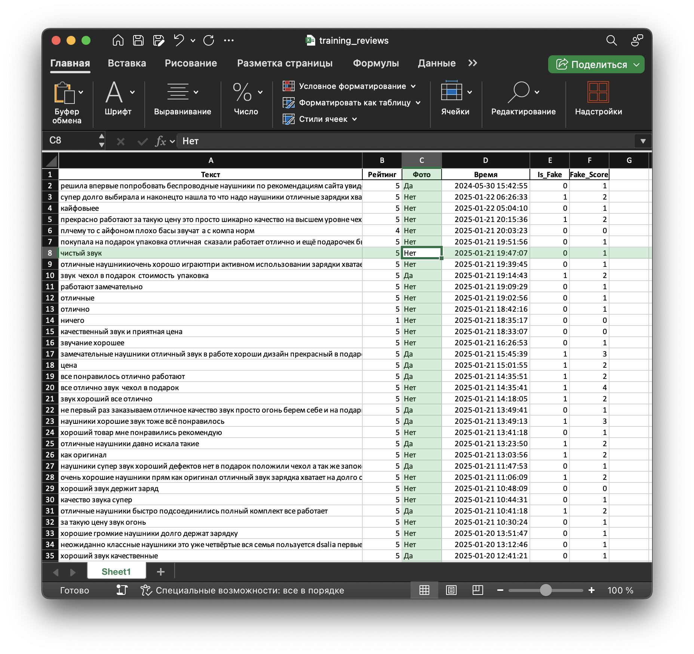

<div align="center">
  <h1> WB Checker: Анализатор накрутки отзывов Wildberries</h1>
  <h3>Обнаружение подозрительных отзывов с помощью машинного обучения / Wildberries fake reviews detection with ML</h3>

  [](https://python.org)
  [](https://python.org)
  [](https://scikit-learn.org)
  [](https://selenium.dev)

</div>

## 🛠️ Технологический стек / Tech Stack

<div style="display: flex; flex-wrap: wrap; gap: 6px; margin-bottom: 15px;">         
</div>

## 🧑‍💻 О проекте / About the project

<div style="display: grid; grid-template-columns: repeat(auto-fit, minmax(300px, 1fr)); gap: 20px; margin: 30px 0;">
  <table align="right">
    <tr>
      <td>
        <b> Этот проект </b><br>
        - анализатор объявлений маркетплейса Wildberries. Система использует машинное обучение для выявления подозрительных и накрученных отзывов, помогая покупателям принимать обоснованные решения.
      </td>
      <td>
        <b> This project </b><br>
        is an intelligent analyzer for one of the most popular marketplace. The system uses machine learning to detect suspicious and fake reviews, helping buyers make informed purchasing decisions.
      </td>
    </tr>
  </table>
</div>

## ✨ Демонстрация / Demo
<table align="center">
    <tr>
      <td>
        <b> Забираем ссылку </b>
      <td>
        <b> Take a URL </b>
    </tr>
  </table>

<table align="center">
    <tr>
      <td>
        <b> Вставляем ссылку </b>
      <td>
        <b> Put a URL </b>
    </tr>
  </table>


## 🏛️ Структура проекта / Project Structure

```
WB_Checker/
├── app/                          
│   ├── core/                     
│   │   ├── data_processor.py     # Очистка и предобработка данных
│   │   ├── model_predictor.py    # ML-модель и анализ
│   │   └── wildberries_parser.py # Парсер Wildberries
│   └── gui/
│       └── main_window.py
├── ml_pipeline/                  
│   └── model/
│       ├── trained_models/       # Предобученные модели
│       │   ├── clf_model.pkl     # Классификатор
│       │   ├── reg_model.pkl     # Регрессия (резерв)
│       │   └── vectorizer.pkl    # Векторизатор TF-IDF
│       └── training_reviews.xlsx # Данные для обучения
└── README.md                     
```

## 🚀 Быстрый старт / Quick Start

```bash
# Клонирование репозитория
git clone https://github.com/your-username/WB_Checker.git
cd WB_Checker

# Установка зависимостей
pip install -r app/requirements.txt

# Запуск приложения
python -m app.gui.main_window
```

---

## 🧠 Как устроено машинное обучение / How machine training works
> [!NOTE]\
> На старте я собрал массив отзывов Wildberries. Вручную разметил 20% выборки по признаку накрутки: распределил оценки по параметрам, собрал «эталон», на котором обучается классификатор.
> Автоматически разметил оставшиеся 80%. Обученная модель классификации использовалась для автодоски меток на остальной части датасета, что ускорило масштабирование и выравнивание качества.
> Базовый классификатор — RandomForestClassifier (100 деревьев, `random_state=42`). В эвристическом модуле параллельно считаю `Fake_Score` на основе факторов
> Оцениваемая `accuracy` не привышает 83, практическая точность показала, что модель уверенно выделяет товары с накруткой при таком показателе.
> После обучения сохраняю векторизатор и модель (`model/vectorizer.pkl`, `clf_model.pkl`, `reg_model.pkl`).

### Преднастроенная таблица для обучения

- Пример структуры набора для обучения определения фейковых объявлений наушников. колонки «Текст», «Рейтинг», «Фото», «Время»:



### Архитектура обработки и обучения:

Сбор → Очистка → Эвристики → Обучение → Инференс на новых данных → Экспорт результатов

- Сбор: `parserall.py` по введённому URL; сохраняет в `parserdata/`.
- Очистка: `cleaner.py` — нормализация времени, чистка текста: регистры, цифры, пунктуация, шумовые заголовки «Достоинства/Недостатки/Комментарий».
- Эвристики: `main.py` — считает `Word_Count`, `Fake_Score`, `Is_Fake` с учётом VADER и временных всплесков.
- Обучение: `model_studysave.py` — TF‑IDF + RandomForest, сохранение артефактов.
- Инференс: `model.py` — подгружает артефакты и помечает новые отзывы (`reviews/reviews_with_scores_*.xlsx`, `reviews/fake_reviews_*.xlsx`).

Примечание по именам артефактов:
- Текущая версия `model.py` читает `model/model.pkl` и `model/vectorizer.pkl`.
- В каталоге также есть `clf_model.pkl` и `reg_model.pkl`. Если вы хотите использовать разделение на классификацию/регрессию, либо переименуйте файлы под `model.py`, либо адаптируйте `app/core/model_predictor.py`, чтобы грузить `clf_model.pkl` и при необходимости `reg_model.pkl`.

3) Порядок запуска Машинного обучения

```bash
pip install -r requirements.txt

# Сбор данных
python parserall.py         # Парсит отзывы с введённой страницы в wildberries_reviews.xlsx 

# Очистка (по умолчанию читает parserdata/wildberries_reviews.xlsx, пишет в cleardata/)
python cleaner.py

# Эвристический анализ (VADER + правила + временные всплески)
python main.py              # Пишет analyzed/fake_* и analyzed/processed_*

# Обучение модели при наличии тренировочного набора
python model_studysave.py   # Создаст/обновит model/vectorizer.pkl и model/model.pkl

# Пример применения обученной модели к данным
python model.py             # Пишет reviews/reviews_with_scores_*.xlsx и reviews/fake_reviews_*.xlsx
```

## 📑 Лицензия / License
> [!IMPORTANT]\
> Этот проект распространяется под лицензией. Подробнее см. в файле [LICENSE](LICENSE).

---

<div align="center">

⭐ **Если проект вам понравился, не забудьте поставить звезду!** / **Don't forget star!**

</div>
